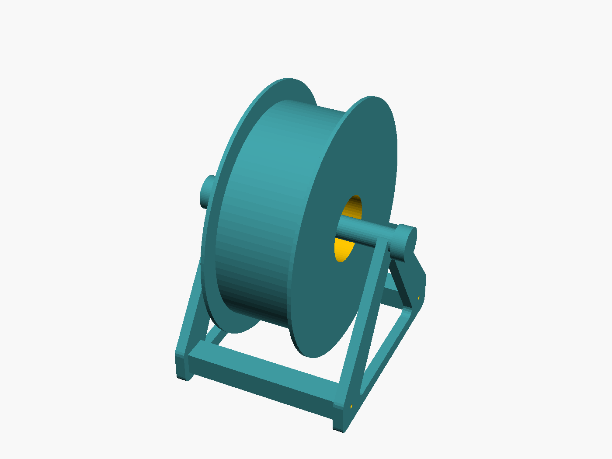

# Parametric filament spool holder

A compact, open-frame filament spool holder designed in OpenSCAD. It takes the
useful layout of common laser-cut desktop holders—a spool axle between two side
frames—and redesigns it as a support-free multipart FDM print.

The model is intentionally unbranded and omits cosmetic panels. Material is
placed only around the load paths, axle cradles, rail sockets, and narrow bottom
ties.



## Browser customizer

Use the hosted customizer at
[burke9077.github.io/3dthings-filament-spool-holder](https://burke9077.github.io/3dthings-filament-spool-holder/).
Set the spool diameter and clear width, choose one to four linked holders, then
download one part or a complete print-pack ZIP. Advanced controls expose print
bed size, axle diameter, M3 nut dimensions, and fit clearances.

The live 3D assembly rebuilds automatically after settings change. The
part-fit clearance preset changes only mating tolerances—rail sockets, nut
pockets, screw bores, axle caps, and link clips—not print speed, layers,
infill, or strength.

The page also offers workflow-sized ZIP groups for the fit coupon, one complete
holder, the configured link kit, or the entire setup. Each archive carries
exact copy counts and settings, and the on-page guide covers print orientation
and assembly.

The customizer runs the official OpenSCAD WebAssembly build entirely in the
browser. Dimensions and generated geometry stay on the device; there is no
model-generation server.

## Features

- Parameterized spool diameter, clear width, base depth, frame, axle, fit, and
  M3 hardware dimensions
- Two identical side frames and two identical crossrails
- Shouldered rail tenons that seat in blind inside-face frame sockets
- Drop-in M3 hex-nut traps that become captive inside those sockets
- Removable printed axle with press-fit end caps
- Repeatable side-by-side link clips that preserve independent spool changes
- Flat, support-free print orientations for every part
- Small nut-fit coupon for calibrating a printer before committing to the rails
- Automatically updating browser-side 3D preview
- OpenSCAD Customizer support and command-line STL export

The defaults provide 125 mm between the side frames and clearance for a 220 mm
diameter spool. A 200 mm × 70 mm example spool is shown only in the assembly
preview.

## Bill of materials

| Item | Quantity | Notes |
| --- | ---: | --- |
| Side frame | 2 | Identical prints |
| Crossrail | 2 | Identical prints; nut openings face upward |
| Axle | 1 | Printed horizontally |
| Axle cap | 2 | Press fit; print closed face on the bed |
| Link clip | 2 per adjacent pair | Optional; one front and one rear |
| M3 hex nut | 4 | Standard 5.5 mm across-flats nut |
| M3 × 10 mm socket-head screw | 4 | M3 × 8 mm also works with most nuts |

## Generate the parts

Open `filament_spool_holder.scad`, choose a value for `part` in the Customizer,
then render and export the STL. Print the quantities listed above.

From a shell with OpenSCAD installed:

```sh
make stls
```

Generated files go into `build/`, which is intentionally not committed. To
regenerate the documentation render:

```sh
make preview
```

## Calibrate before printing

Print `build/nut_fit_test.stl` first:

```sh
make build/nut_fit_test.stl
```

A nut should drop into the top opening without rotating in its hex pocket, and
an M3 screw should pass through the horizontal bore. Adjust
`m3_nut_clearance` or `m3_hole_diameter` if needed. The defaults target a
reasonably tuned FDM printer; dimensional behavior varies by material and
machine. In the browser customizer, choose **Extra clearance** when mating
parts bind or **Reduced clearance** when they feel loose.

## Suggested print settings

- 0.20 mm layer height
- 4 perimeters
- 4 top and bottom layers
- 25% gyroid or cubic infill
- PLA, PETG, or ASA
- No supports

Print each side frame flat with its two shallow rail recesses upward. Print each
rail on its broad face with both nut openings upward. The axle has a faceted
flat and is already oriented horizontally; a brim can help with low-adhesion
materials. Print caps with the closed flange against the bed and the socket
upward.

## Assembly

1. Set both crossrails down with their nut openings facing up.
2. Drop an M3 nut into each of the four hex pockets.
3. Seat both shouldered tenons in the shallow recesses on one side frame, then
   add the second frame with its recesses facing inward.
4. Install the four M3 screws through the small holes on the outside faces.
   Square the holder on a flat surface and tighten them evenly.
5. Slide the axle through the spool, lower it into the open cradles, and press
   a cap onto each end.

The blind side-frame sockets cover the nut openings after assembly, so the nuts
cannot escape or turn. The rail shoulders bear against the inside frame faces;
tightening each screw therefore clamps the joint instead of merely retaining
it.

## Link two or more holders

Keep each holder complete, including both side frames and its own axle. Put two
holders side by side, leaving the facing outside frames separated by
`link_gap`, then press one link clip over the two front frame edges and a second
clip over the rear edges. The rounded lower frame corners locate the clips
vertically.

The default 32 mm gap leaves clearance between two facing axle caps. Each
additional holder needs two more clips:

| Holders | Link clips |
| ---: | ---: |
| 1 | 0 |
| 2 | 2 |
| 3 | 4 |
| 4 | 6 |

This deliberately keeps each axle independent. A shared center frame or single
long axle would save one frame, but changing one spool would disturb its
neighbor.

## Important parameters

| Parameter | Default | Purpose |
| --- | ---: | --- |
| `spool_max_diameter` | 220 mm | Sets axle height with floor clearance |
| `inside_width` | 125 mm | Clear distance between side frames |
| `base_depth` | 175 mm | Front-to-back footprint |
| `spool_floor_clearance` | 12 mm | Clearance under the largest spool |
| `frame_thickness` | 8 mm | Thickness of each flat side frame |
| `frame_web` | 14 mm | Minimum structural web around the large cutout |
| `axle_diameter` | 18 mm | Printed axle diameter |
| `axle_facets` | 32 | Round axle profile with a narrow printable flat |
| `rail_fit_clearance` | 0.30 mm | Per-side clearance in frame sockets |
| `m3_nut_clearance` | 0.25 mm | Per-side nut-pocket clearance |
| `axle_cap_fit_clearance` | 0.25 mm | Diametral cap socket clearance |
| `link_gap` | 32 mm | Gap between linked modules |
| `link_fit_clearance` | 0.15 mm | Per-side clearance around linked frames |
| `holder_count` | 2 | Complete modules shown in `linked_assembly` |

Changing the spool envelope automatically updates the axle height and overall
rail/axle lengths. OpenSCAD assertions reject combinations that would cut rail
sockets through the frame or leave too little material around the axle.

## License

The design and customizer are licensed under the [MIT License](LICENSE).
